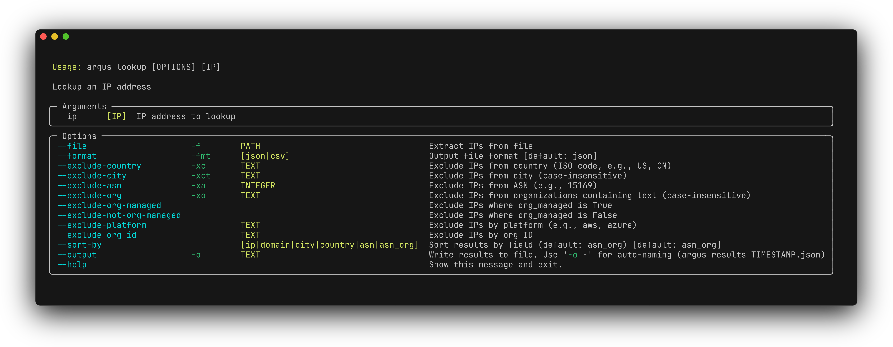

# argus


Fast IP lookups using MaxMind GeoIP2 and IP2Proxy databases.

## Prereqs

- Install uv from [https://docs.astral.sh/uv/getting-started/installation/](https://docs.astral.sh/uv/getting-started/installation/)
- Get a free MaxMind license key at [https://www.maxmind.com/en/geolite2/signup](https://www.maxmind.com/en/geolite2/signup)
- Get a free IP2Proxy download token at [https://www.ip2location.com/register](https://www.ip2location.com/register)

## Install

```bash
uv tool install git+https://github.com/bowenaguero/argus-cli
```

## Setup

```bash
argus setup
```

## Usage

```bash
# Single IP
argus lookup 8.8.8.8

# From file
argus lookup -f ips.txt

# Filter results
argus lookup -f ips.txt -xc Germany -xa 15169

# Export to JSON/CSV
argus lookup -f ips.txt -o results.json
```

## Options


