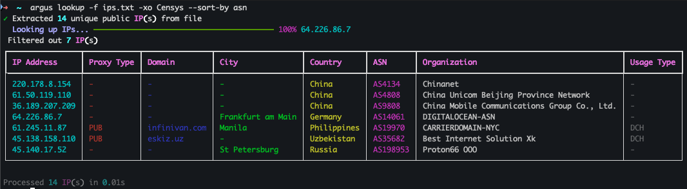

# argus

<kdb></kbd>

Fast IP lookups using MaxMind GeoIP2 and IP2Proxy databases.

## Install

```bash
uv tool install git+https://github.com/bowenaguero/argus-cli
```

## Setup

```bash
argus setup
```

- Get a free MaxMind license key at [https://www.maxmind.com/en/geolite2/signup](https://www.maxmind.com/en/geolite2/signup)
- Get a free IP2Proxy download token at [https://www.ip2location.com/register](https://www.ip2location.com/register)

## Usage

```bash
# Single IP
argus lookup 8.8.8.8

# From file
argus lookup -f ips.txt

# Filter results
argus lookup -f ips.txt -xc US -xa 15169

# Export to JSON/CSV
argus lookup -f ips.txt -o results.json
```

## Options

- `-f, --file` - Extract IPs from file (txt, pdf, xlsx)
- `-xc, --exclude-country` - Exclude countries
- `-xct, --exclude-city` - Exclude cities
- `-xa, --exclude-asn` - Exclude ASN numbers
- `-xo, --exclude-org` - Exclude organizations
- `-o, --output` - Write results to file
- `-fmt, --format` - Output format: json or csv
- `--sort-by` - Sort results by field

## License

MIT
